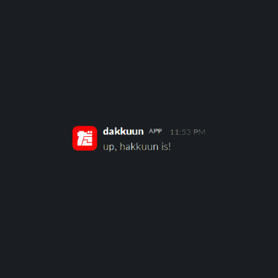

Made for Hack Club Arcade with GitHub Copilot as an assistant

# dakkuun

Checks if the hackhour bot (currently hakkuun) is down or not. Can also send you a reminder when it's hakkuun is back up again.

## Commands

-   `/down` - checks if hakkuun is up or not
-   `/dakkuun` - reminds you when hakkuun gets back up again

## License

Licensed under the [MIT License](./LICENSE).
